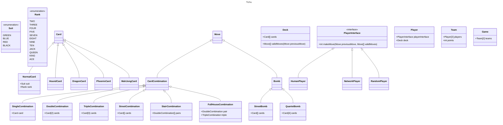

# UML Diagram

```mermaid
---
title: Tichu
---
classDiagram
    class Suit {
        <<enumeration>>
        GREEN
        BLUE
        RED
        BLACK
    }

    class Rank {
        <<enumeration>>
        TWO
        THREE
        FOUR
        FIVE
        SEVEN
        EIGHT
        NINE
        TEN
        JACK
        QUEEN
        KING
        ACE
    }

    class Card

    class NormalCard {
        +Suit suit
        +Rank rank
    }

    class HoundCard
    class DragonCard
    class PhoenixCard
    class MahJongCard

    Card <|-- NormalCard
    Card <|-- HoundCard
    Card <|-- DragonCard
    Card <|-- PhoenixCard
    Card <|-- MahJongCard

    class CardCombination

    class SingleCombination {
        +Card card
    }

    class DoubleCombination {
        +Card[2] cards
    }

    class TripleCombination {
        +Card[3] cards
    }
    
    class StreetCombination {
        +Card[] cards
    }

    class FullHouseCombination {
        +DoubleCombination pair
        +TripleCombination triple
    }

    class StairCombination {
        +DoubleCombination[] pairs
    }

    CardCombination <|-- SingleCombination
    CardCombination <|-- DoubleCombination
    CardCombination <|-- TripleCombination
    CardCombination <|-- StreetCombination
    CardCombination <|-- StairCombination
    CardCombination <|-- FullHouseCombination

    class Bomb

    class StreetBomb {
        +Card[] cards
    }

    class QuartetBomb {
        +Card[4] cards
    }

    Bomb <|-- StreetBomb
    Bomb <|-- QuartetBomb

    class Move

    Move <|-- CardCombination
    Move <|-- Bomb

    class Deck {
        +Card[] cards

        +Move[] validMoves(Move previousMove)
    }

    class PlayerInterface {
        <<interface>>
        +int makeMove(Move previousMove, Move[] validMoves)
    }

    class HumanPlayer

    class NetworkPlayer

    class RandomPlayer

    PlayerInterface <|-- HumanPlayer
    PlayerInterface <|-- NetworkPlayer
    PlayerInterface <|-- RandomPlayer

    class Player {
        +PlayerInterface playerInterface
        +Deck deck
    }

    class Team {
        +Player[2] players
        +int points
    }

    class Game {
        +Team[2] teams
    }
```
